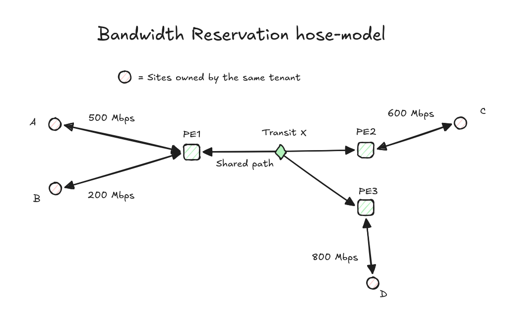
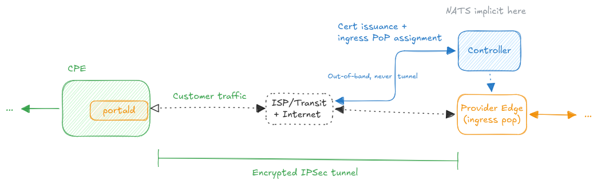
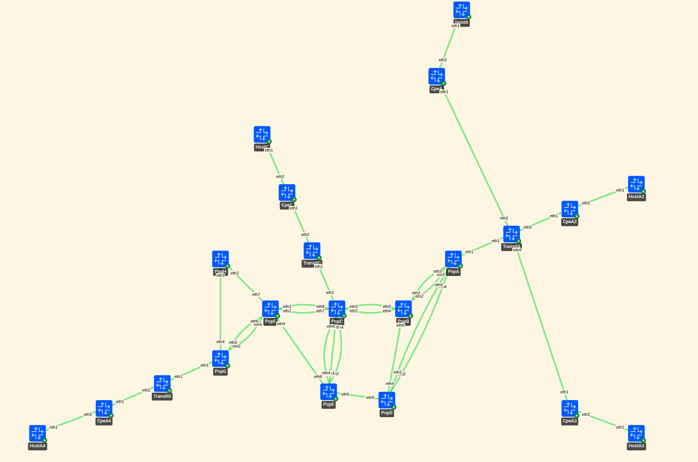
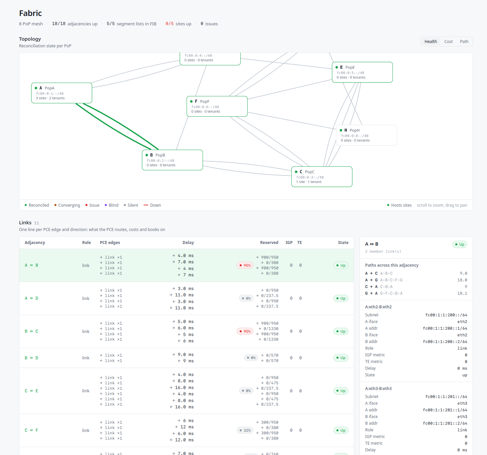
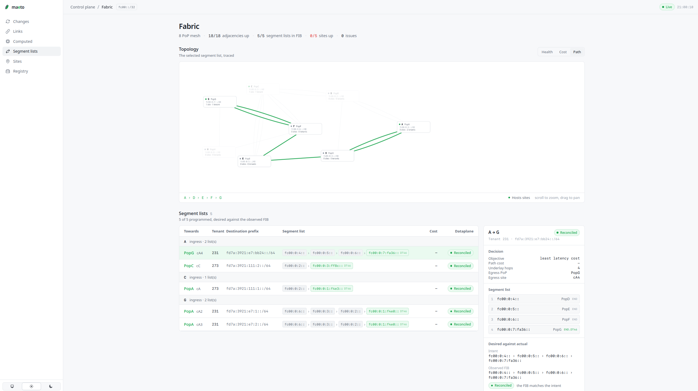
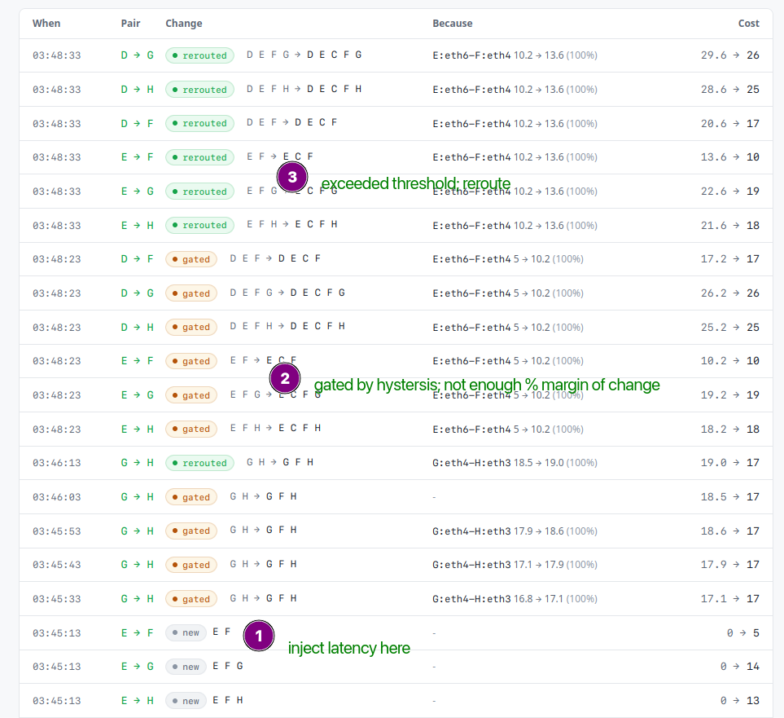

---

Maeto is a SRv6-based SD-WAN control plane. Computes directional least-cost paths across a PoP mesh and programs the kernel dataplane. It's a hobby project.

> [!NOTE]
> The repository on GitHub is a mirror maintained for visibility. Issue tracking and active development are done on [GitLab.](https://gitlab.com/saphalpdyl/Maeto)

[](https://opensource.org/licenses/Apache-2.0)
[](https://gitlab.com/saphalpdyl/maeto/-/commits/main)


## Architecture
This is the conceptual architecture of the system excluding implementation features. v0 uses simple protobuf-based contracts instead of PCEP. The agent used to shell out for linux commands; it talks Netlink now.


### Reconciliation
Everything that touches state is level-triggered. The agent renders what it wants from the intent, reads what the kernel actually has over Netlink, diffs the two as typed resources, and applies the difference. It never applies deltas. A dropped message, a crashed agent, or someone poking `ip -6 route` by hand all converge on the next pass.

Each resource carries its own identity and its own comparison. `ID()` has to be exactly as discriminating as the dataplane's key for the same object. Coarser and it thrashes; finer and it never converges, because the model believes two things can coexist where the kernel only holds one.

The agent reads and writes only routes tagged with its own protocol numbers, so it never fights FRR and will not touch anything it did not install.

Intent moves the same way. Agents watch a NATS KV key and get the current value rather than a stream of changes, so a restart needs no replay.

### Measurement
Probes are one-way. The sender does not ask for a reply, the reflector timestamps what it receives and publishes its own result. Both directions of a link are measured separately.

The generator builds the physical fabric and the control plane measures it. Propagation delay is applied with netem and deliberately never handed to the controller. If the controller wants to know how far apart two PoPs are, it has to find out.

Costs are continuous and shortest-path over continuous costs flaps. The PCE will not move a path unless the alternative is at least 10% cheaper, and it records the near-misses too.

### Bandwidth reservation


Sites reserve bandwidth, not pairs of sites. A tenant's sites at the same PoP add up to one rate for that PoP, so PE1 above sends and receives at most 500 + 200 = 700 Mbps.

The PCE books a hose bound on every directed edge a tenant's paths cross: the smaller of what the PoPs on one side can send and what the PoPs on the other side can receive, each PoP counted once. On the shared path out of PE1 that is min(700, 600 + 800) = 700 Mbps. Booking each pair on its own would reserve 600 + 700 = 1300 Mbps for traffic that can never exceed 700.

Each direction of a link is its own edge with its own capacity, so the way back into PE1 gets its own bound. Traffic classes get a bound each and add up. A path is admitted only if the sum over tenants stays under 95% of every edge it crosses. Paths are computed per pair, so the bound is an upper bound rather than exact, which errs on the safe side.

### CPE onboarding


Customer traffic rides an IPsec tunnel from the CPE to its ingress PoP, across whatever ISP or transit sits in between. `portald` on the CPE brings it up, strongSwan carries it, IKEv2 with mutual X.509.

Certificates are the identity. Each CPE holds a portal ID that works like an LDevID, and its cert is issued off the maeto CA against `<portal-id>.cpe.maeto.net`. The PoP presents `<node>.maeto.net`. Neither side trusts an address, they trust the certificate, so a CPE can move networks and still come up.

The control path never goes through the tunnel. `portald` asks the controller over NATS who it is and where it attaches, and gets back its own strongSwan identity, the PoP's, the PoP's access address, and its site prefix. That is out-of-band on purpose: the tunnel cannot bootstrap itself.

Once the SA is up the PoP lands the traffic on an xfrm interface inside the tenant VRF, which is where the SRv6 side picks it up.

### Topology
The project ships with a default eight POP topology to test on. `PopX` represent the POP (P/PE Router). The `agent` runs on these.
`CpeX` represent he Customer Premises Equipment(CPE). The `portal` daemon runs on CPEs. `Transit` represent the unowned middle-mile. `Host` represent devices connected to the portal/CPE.


## Running it
Needs docker, containerlab and python3. `pki` is VM-only, it shells out to strongSwan's `pki`.

```sh
vagrant up # Highly recommended to run in VMs
vagrant ssh

make setup   # venvs + git hooks
make pki     # one-time CA, the generator signs PoP and CPE certs off it
make ap      # generate the topology, build the images, deploy the lab
make fe      # maeto-pane
```

`make ips` prints the container addresses. `make clean` tears the lab down.

## Layout
```
libs/stamp              RFC 8762 sender and reflector, wire codec, SRv6 TLVs
libs/dataplane          netlink -- vrfs, seg6/seg6local, xfrm, declarative reconciler
libs/probe              probe supervisor, STAMP runners, NATS dispatch
libs/nodesync           intent and snapshot contracts over NATS KV
services/control-plane  topology, intent, cost graph, PCE
services/argus          EWMA and beta-binomial detectors
services/maeto-agent    runs on each PoP, reconciles intent onto the kernel
services/maeto-portal   runs on each CPE
services/maeto-pane     phoenix liveview ui
clab/generator          topology dsl -> containerlab, frr, addressing, link shaping
```

## Writeups
Things I hit along the way, mostly SRv6 and FRR: [blogs.saphal.me/tags/srv6](https://blogs.saphal.me/tags/srv6/)

## Status
Done/In-progress:
- SRv6 dataplane over Netlink. VRFs, xfrm interfaces, seg6/seg6local SIDs and ip rules, reconciled against a desired state
- Eight-pop IS-IS + SRv6 uSID fabric, generated from one topology file along with addressing, FRR config and link shaping
- Intent distributed to agents over NATS KV
- IKEv2/X.509 tunnels out to the CPEs
- Per-link one-way STAMP probing (RFC 8762). The reflector exports its own receive timestamps instead of reflecting
- Latency cost graph fed from the probes. PCE recomputes every tick, 10% gate before it will actually move a path
- maeto-pane: topology, per-link cost, and path changes with the edge whose cost caused them
- Bandwidth-aware hose-modeled path computation

Not yet:
- Loss and jitter are seeded values, only latency is measured
- Argus detectors exist but nothing is wired to them. Argus implemented have been ported over to control plane temporarily for "Make it work, before making it right".

## Screenshots 




---
 by saphalpdyl
